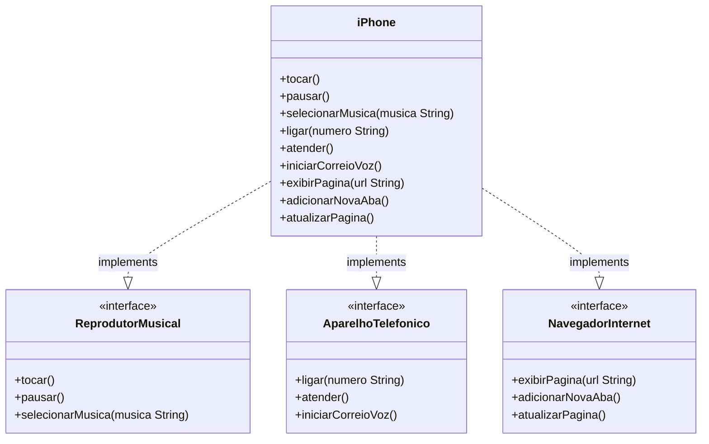

# Desafio POO — Modelagem iPhone

Projeto desenvolvido como parte do **Bootcamp Claro - Java com Spring Boot** na plataforma [DIO](https://www.dio.me/).

---

## Descrição

Modelagem orientada a objetos do componente iPhone, representando suas três funcionalidades principais como contratos de interface — seguindo o princípio de que o iPhone *tem a capacidade de* reproduzir música.

---

## Diagrama UML



---

## Estrutura do Projeto

```
DesafioPooIPhone/
├── src/
│   └── br/
│       └── com/
│           └── desafioiphone/
│               ├── ReprodutorMusical.java
│               ├── AparelhoTelefonico.java
│               ├── NavegadorInternet.java
│               ├── iPhone.java
│               └── Main.java
└── README.md
```

---

## Interfaces

### `ReprodutorMusical`
Define o contrato para reprodução de músicas.

| Método | Descrição |
|---|---|
| `tocar()` | Inicia a reprodução |
| `pausar()` | Pausa a reprodução |
| `selecionarMusica(String musica)` | Seleciona uma música pelo nome |

### `AparelhoTelefonico`
Define o contrato para funções de telefonia.

| Método | Descrição |
|---|---|
| `ligar(String numero)` | Realiza uma chamada |
| `atender()` | Atende uma chamada recebida |
| `iniciarCorreioVoz()` | Acessa o correio de voz |

### `NavegadorInternet`
Define o contrato para navegação na web.

| Método | Descrição |
|---|---|
| `exibirPagina(String url)` | Carrega e exibe uma URL |
| `adicionarNovaAba()` | Abre uma nova aba no navegador |
| `atualizarPagina()` | Recarrega a página atual |

---

## Por que interfaces e não classes abstratas?

| Critério | Interface | Classe Abstrata |
|---|---|---|
| Herança múltipla | Sim | Não |
| Contrato de comportamento | Sim | Parcial |
| Estado (atributos) | Não | Sim |


---

## Como Executar

**1. Compilar:**
```bash
javac -d bin src/br/com/desafioiphone/*.java
```

**2. Executar:**
```bash
java -cp bin br.com.desafioiphone.Main
```

**Saída esperada:**
```
=== Reprodutor Musical ===
Música selecionada: Bohemian Rhapsody
Reproduzindo música...
Música pausada.

=== Aparelho Telefônico ===
Ligando para: (11) 99999-0000
Atendendo chamada...
Iniciando correio de voz...

=== Navegador na Internet ===
Exibindo página: https://www.apple.com
Nova aba adicionada.
Página atualizada.
```

---

## Tecnologias

- Java 21
- Orientação a Objetos — interfaces, polimorfismo, encapsulamento
- Princípio de design: programar para interfaces, não para implementações

---

## Autor

Desenvolvido durante o **Bootcamp Claro - Java com Spring Boot**  
Plataforma: [DIO — Digital Innovation One](https://www.dio.me/)
Link Desafio: https://github.com/digitalinnovationone/trilha-java-basico/tree/main/desafios/poo