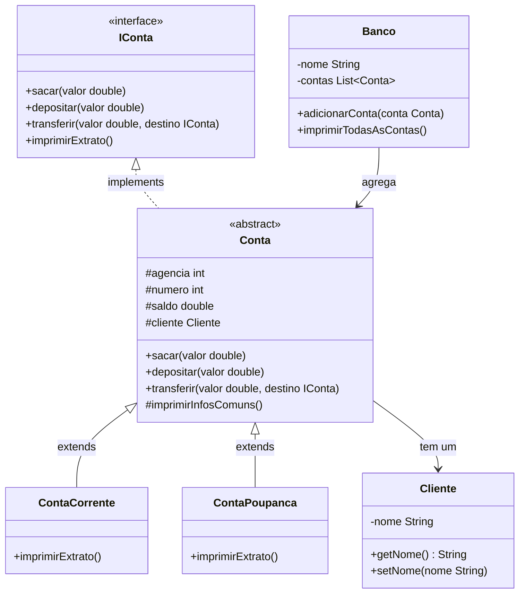

# Banco Digital — POO com Java

Projeto desenvolvido como parte do **Bootcamp Claro - Java com Spring Boot** na plataforma [DIO](https://www.dio.me/).

---

## Descrição

Implementação de um banco digital aplicando os quatro pilares da Programação Orientada a Objetos em Java. O sistema permite criar contas correntes e poupança, realizar depósitos, saques, transferências e emitir extratos individuais ou consolidados por banco.

---

## Diagrama UML



---

## Os Quatro Pilares aplicados

**Abstração** — `Conta` é uma classe abstrata que modela o conceito genérico de conta bancária, sem representar um tipo específico. Apenas `ContaCorrente` e `ContaPoupanca` são instanciáveis.

**Encapsulamento** — atributos como `saldo`, `agencia` e `numero` são protegidos (`protected`/`private`). O acesso externo ocorre apenas via getters e métodos de negócio como `sacar()` e `depositar()`.

**Herança** — `ContaCorrente` e `ContaPoupanca` herdam de `Conta`, reutilizando toda a lógica comum e sobrescrevendo apenas `imprimirExtrato()`.

**Polimorfismo** — as contas são referenciadas pelo tipo `Conta` ou `IConta`, permitindo que o `Banco` trate qualquer tipo de conta de forma uniforme.

---

## Evoluções em relação ao projeto de referência

| Melhoria | Detalhe |
|---|---|
| Validação no `sacar()` | Impede saldo negativo e valores inválidos |
| Validação no `depositar()` | Rejeita valores menores ou iguais a zero |
| `Banco` conectado ao `Main` | Classe `Banco` passa a ser usada de fato |
| `adicionarConta()` no Banco | Encapsula a adição de contas à lista |
| `imprimirTodasAsContas()` | Extrato consolidado de todas as contas |
| `String.formatted()` | Substituído `String.format()` estático pelo método de instância (Java 17+) |
| Encoding corrigido | `ContaPoupança` com caractere especial corrigido |
| Package declarado | Todas as classes organizadas em `br.com.bancodigital` |

---

## Estrutura do Projeto

```
BancoDigital/
├── src/
│   └── br/
│       └── com/
│           └── bancodigital/
│               ├── IConta.java
│               ├── Cliente.java
│               ├── Conta.java
│               ├── ContaCorrente.java
│               ├── ContaPoupanca.java
│               ├── Banco.java
│               └── Main.java
└── README.md
```

---

## Como Executar

**1. Compilar:**
```bash
javac -d bin src/br/com/bancodigital/*.java
```

**2. Executar:**
```bash
java -cp bin br.com.bancodigital.Main
```

**Saída esperada:**
```
Saldo insuficiente. Saldo atual: R$ 200,00

=== Extrato Conta Corrente ===
Titular: Venilton
Agência: 1
Número: 1
Saldo: R$ 500,00

=== Extrato Conta Poupança ===
Titular: Venilton
Agência: 1
Número: 2
Saldo: R$ 300,00

=== Extrato Conta Corrente ===
Titular: Maria
Agência: 1
Número: 3
Saldo: R$ 200,00
```

---

## Tecnologias

- Java 21
- Orientação a Objetos — abstração, encapsulamento, herança, polimorfismo
- Interface como contrato de comportamento
- `String.formatted()` — Java 17+

---

## Autor

Desenvolvido durante o **Bootcamp Claro - Java com Spring Boot**
Plataforma: [DIO — Digital Innovation One](https://www.dio.me/)
